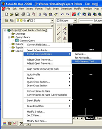

# Getting Started  

## Installation  

### Prerequisites  

The plug-in (***SurvUtilArx.arx***) is targeted for **AutoCAD 2000i**  **ONLY**. It CANNOT be executed in any other AutoCAD version.  

### Installing Plug-In
  
| # | Steps |
|--|--|
| 1 | Copy files |
| 2 | Create a Folder in local Hard Disk Drive. e.g. “C:\AutoCAD Utilities” |
| 3 | Copy ***SurvUtilArx.arx*** from the delivered binaries to the newly created folder |

### Executing the Plug-In

Execute the following command to load the plug-in…

>Command: **arx** [And load the plug-in file **“SurvUtilArx.arx”**]  

## Features

### 1. Export point's co-ordinates along with adjacent text  

Execute the following command to export user selected point coordinates along with the text from the TEXT entities adjacent to the selected points.
  
`Command: ExportPointsWithNeaText`  

Alternatively click on the menu as shown below…

  
|Step| Description |
|--|--|
| 1 | Select file to which data to be exported. |
| 2 | Enter maximum allowed distance between a POINT & the nearest TEXT. The default value is “Unlimited”, meaning the check will not be enforced. |
| 3 | Select the entities to be exported.|

The following table shows the log of a sample execution… 

> Command: ExportPointsWithNeaText
> Select objects: all 3205 found
> 5 were filtered out.
> Select objects:
> Please wait...Extracting data from entity #3200
> Please wait...Writing data for Layer: 0 [Layer #1 of 1]00# of Texts]
> 
> File "P:\Temp Files\New Folder\Aa.TXT" written successfully
> Total 1600# of points exported

### 2. Draw Table importing data from Excel Work Sheet  

Execute the following command to export user selected point coordinates along with the text from the TEXT entities adjacent to the selected points.  

`Command: DrawTableUsingXLSdata`

Alternatively click on the menu as shown below…
  

| Step | Description                                                                                |
|------|--------------------------------------------------------------------------------------------|
| 1    | Select file to which data to be imported                                                   |
| 2    | Read/Parse the data.                                                                       |
| 3    | Set the matching criteria by specifying the column to match & the value to match           |
| 4    | Check the matching record [Optional]                                                       |
| 5    | Hit ‘OK’ to draw                                                                           |
| 6    | Pick/Enter the upper left corner of the table to be drawn.                                 |
| 7    | Table will be drawn considering the user picked point as upper left corner of the table.   |

Given below the log of a sample execution…
  
> `Command: DrawTableUsingXLSData`
> Sheet #1, Name “Master”
> Pick upper left corner of the table to be drawn:
> Table drawn successfully [Matching Criteria:”FieldBook No. == 2060”;
> Data file:“P:\Data\XLS Sample\General Table Reading.xls”  

### 3. More features

To be done
